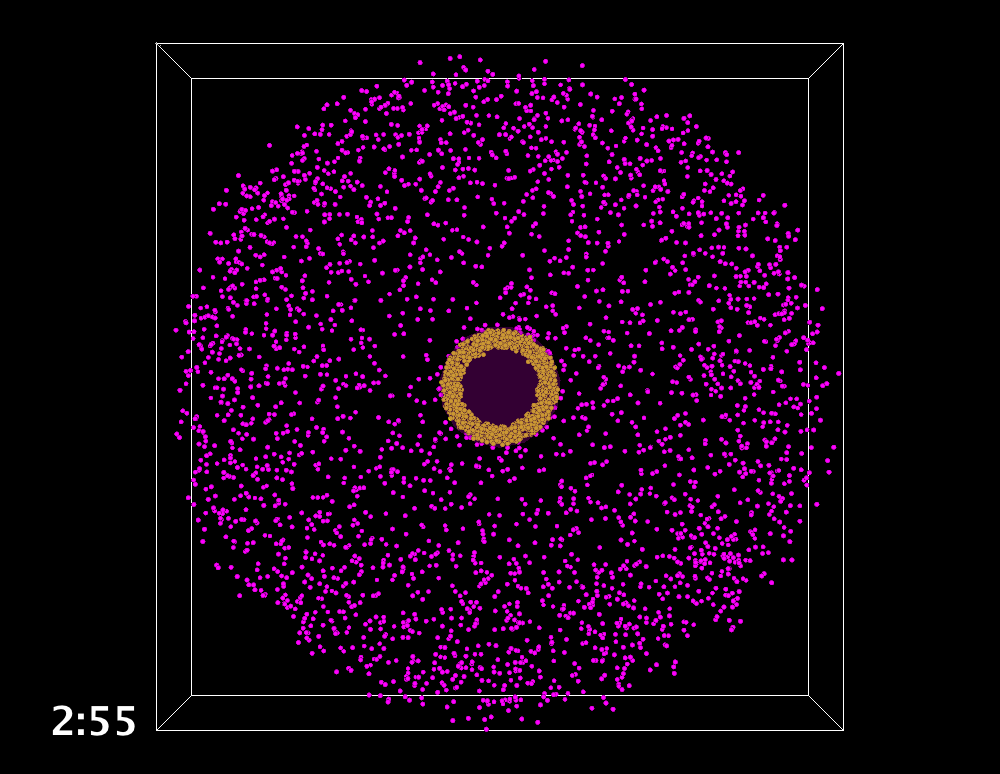

# Motilisim

A 3D simulation of cells (modeled as non-overlapping spheres) moving in space, written in Java.
Cellular motion can be driven by a variety of random walk models, including Levy flights, correlated random walks and Brownian motion.
There is functionality to model chemotactic factors and cellular responses thereto.

In the above image, chemotactic T cells are modelled as congregating around a central bolus that represents a tumour.

## Getting started

I used Eclipse on a Mac to run the model.
The simulation can be launched in a variety of ways.

To run with the GUI, launch the `main` method in `src/portrayal/GUI_ChemotacticAgent.java` (or the similar classes related to neutrophils and T cells).

To run without the GUI, look to `src/core/Simulation<cell name>`.

The `launch_<...>.py` scripts can be used to run the simulation from the bash command line.

You'll generally need to point the model at a `parameters.xml` file to provide it with the specifics needed for a given experiment.
You can use the default xml file provided, or copy and move them elsewhere.
There are multiple ways of specifying the path to the parameters file, they can be specified in the variables near the top of the Java files, or they can be supplied through a command line argument.
There are other parameters such as where the data should be written to on the file system.

## Why several ways to run the model?

The model has been used for multiple research projects.
Some shared commonalities, but there were different cell types, behaviours and environmental setups involved in each, and these were encoded as different classes.
All the common behaviours were pushed as far up the inheritance tree as possible.

## Chemotactic factors

Included is a framework for modulating motility through diffusing soluble factors.
Cells secreting such factors at a given point and time are recorded, and the concentration of a soluble factor at (another) point and time is resolved by numerically solving a partial differential equation.
Note that running this sort of experiment can dramatically slow down the model as execution proceeds.

## Model output

You will want to specify a directory to which data should be written.
You can find example output in the directory `results/example_continuous_attraction/`.
For a lot of cells (tens of thousands) the simulation can get quite slow, and this includes the MASON-provided GUI.
If you run the model without the GUI (e.g. from command line or high performance computing facility), you can `src/re-enact` the visualisation if you point the relevant Java class at the corresponding raw data.

I have had to delete the latter half of the `_Position.csv` file, and compress it, to upload it to GitHub (100MB file limit).

## History

I started working on cellular motility in around 2014.
This repository is relatively new, because the first iteration of the model was released as a ZIP file with the corresponding 2016 PLOS Computational Biology paper.
Since that time, this model (and theme of work) has contributed to the following papers.

> Hywood, J. D., Rice, G., Pageon, S. V, Read, M. N., & Biro, M. (2021). Detection and characterisation of chemotaxis without cell tracking. Journal of the Royal Society Interface, 18, 20200879.

> Galeano Niño, J. L., Pageon, S. V, Tay, S. S., Colakoglu, F., Kempe, D., Hywood, J., … Biro, M. (2020). Cytotoxic T cells swarm by homotypic chemokine signalling. ELife, 9, 1–40. https://doi.org/10.7554/elife.56554

> Moran, I., Nguyen, A., Khoo, W. H., Butt, D., Bourne, K., Young, C., … Phan, T. G. (2018). Memory B cells are reactivated in subcapsular proliferative foci of lymph nodes. Nature Communications, 9(1), 3372. https://doi.org/10.1038/s41467-018-05772-7

> Read, M. N., Bailey, J., Timmis, J., & Chtanova, T. (2016). Leukocyte Motility Models Assessed through Simulation and Multi-objective Optimization-Based Model Selection. PLOS Computational Biology, 12(9), e1005082. https://doi.org/10.1371/journl.pcbi.1005082

> Hywood, J. D., Read, M. N., & Rice, G. (2016). Statistical analysis of spatially homogeneous dynamic agent-based processes using functional time series analysis. Spatial Statistics, 17, 199–219. https://doi.org/10.1016/j.spasta.2016.06.002

## Java3D adventures

Old java3d libraries don't work on modern Java versions (the last JRE I got them working on was 1.6).
This kicks up all manner of javax- and AWT-related errors.
If you haven't seen them, be happy.
Something to do with Oracle not supporting java3d anymore.

However, MASON uses it.
Thankfully MASON has also provided a work around, see the "3D Libraries" section half way down this page:
`https://cs.gmu.edu/~eclab/projects/mason/`

The j3dlibs directory contains a copy of the jar files (also download-able from the MASON homepage) needed to get java3D working on JRE 1.8 (at least on Mac, I haven't tested on other OSs).
The instructions state "Install these in your system-wide Java library location (on the Mac, it's /Library/Java/Extensions/)".
On one machine I was able to add the `j3dlibs/*.jar` files to the Eclipse project build path, and it worked.
On my other machine, running the exact same JRE1.8, I had to put j3dlibs/*.jar files into /Library/Java/Extensions.
I have no idea what casued this discrepancy, the project and java configurations in Eclipse were identical. Flakey indeed.
This should be fine, either way, you only need these files for visualisation, the simulation should run ok on a cluster (where you do not necessarily have sudo privileges to install these jars at the system level) if you are running the simulation headless.

Best of luck to you, I hope this solves any java3d issues you have, because java3d has quite a challenge in recent years.
